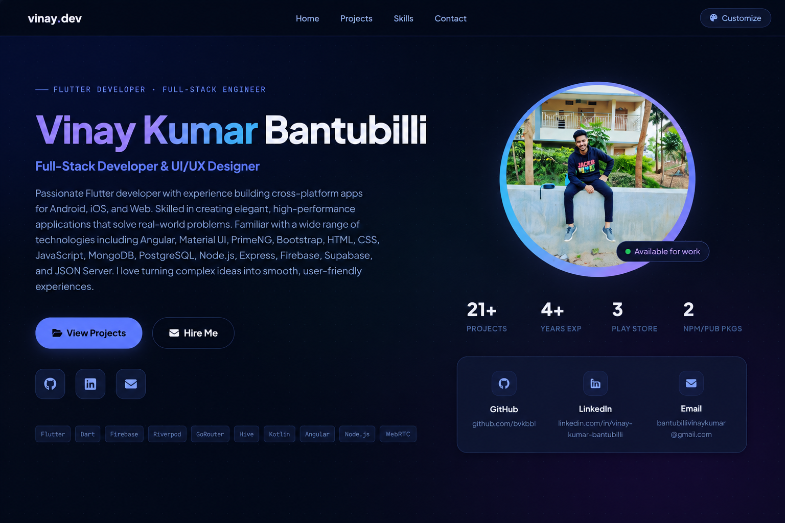
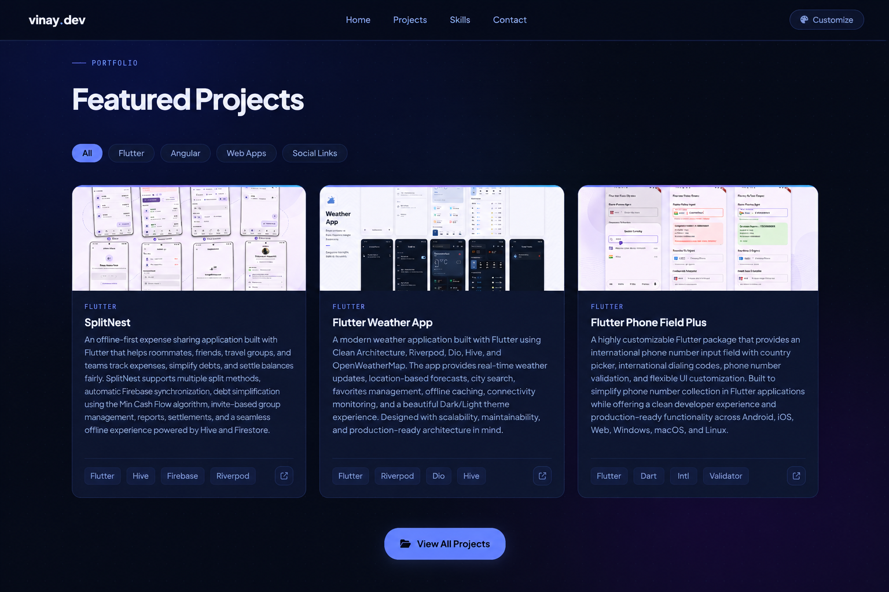

# 🚀 Vinay Kumar Bantubilli — Developer Portfolio

A modern, highly customizable developer portfolio website built with vanilla HTML, CSS, and JavaScript.

This portfolio showcases projects, skills, achievements, and social profiles through a fully responsive interface with dynamic themes, typography customization, project filtering, modal previews, and persistent user preferences.

<!-- ---



---



--- -->
<p align="center">
  
  
</p>

## ✨ Features

### Core Features

* 🎨 10 Built-in Themes
* 🔤 10 Google Font Combinations
* 📐 Adjustable Project Card Height
* 🔍 Project Category Filtering
* 🖼️ Project Preview Modals
* 💾 Persistent User Settings
* ✨ Scroll-Based Animations
* 📱 Fully Responsive Design
* 🍔 Mobile Navigation Drawer
* ♿ Accessibility Support
* ⚡ Zero Framework Dependencies

### Interactive UI

* Animated Profile Avatar Ring
* Floating Gradient Orbs
* Cursor Glow Effect
* Smooth Navigation Scrolling
* Hover Animations
* Dynamic Mesh Background
* Project Galleries
* Social Media Cards

---

## 🛠 Technologies

* HTML5
* CSS3
* JavaScript (ES6+)
* Font Awesome
* Google Fonts
* LocalStorage API
* Intersection Observer API

---

## 📁 Project Structure

```text
portfolio/
│
├── index.html
├── style.css
├── app.js
├── data.json
│
├── assets/
│   ├── profile_img.jpg
│   └── preview.png
│
├── screenshots/
│   ├── project1.png
│   ├── project2.png
│   └── ...
│
└── README.md
```

---

## 🚀 Getting Started

### Clone Repository

```bash
git clone https://github.com/bvkbb1/portfolio.git
cd portfolio
```

### Run Locally

Using Python:

```bash
python -m http.server 8000
```

Using Node.js:

```bash
npx serve .
```

Open:

```text
http://localhost:8000
```

---

## ⚙️ Configuration

All portfolio content is managed through:

```text
data.json
```

Update:

* Profile Information
* Social Links
* Skills
* Projects
* Categories
* Project Images
* Store Links
* GitHub Links

No code modifications are required for normal content updates.

---

## 🎨 Theme Support

Included Themes:

1. Midnight
2. Aurora
3. Obsidian
4. Crimson
5. Nebula
6. Arctic
7. Sakura
8. Forest
9. Ember
10. Slate

Themes are stored automatically using browser localStorage.

---

## 🔤 Font Support

Included Fonts:

* Space Grotesk
* Syne
* Outfit
* Plus Jakarta Sans
* Raleway
* Nunito
* Manrope
* Oxanium
* JetBrains Mono
* DM Sans

---

## 📱 Responsive Design

Optimized for:

| Device          | Support |
| --------------- | ------- |
| Desktop         | ✅       |
| Laptop          | ✅       |
| Tablet          | ✅       |
| iPad            | ✅       |
| Android Tablets | ✅       |
| Mobile Phones   | ✅       |

---

## 🚢 Deployment

Deploy instantly using:

### GitHub Pages

```bash
git push origin main
```

### Netlify

Connect repository and deploy.

### Vercel

Import repository and deploy.

### Firebase Hosting

```bash
firebase deploy
```

---

## 📸 Portfolio Preview

Replace:

```text
assets/preview.png
```

with your latest portfolio screenshot.

---

## 👨‍💻 About Me

**Vinay Kumar Bantubilli**

Flutter Developer passionate about building scalable, production-ready applications.

### Expertise

* Flutter
* Dart
* Firebase
* Riverpod
* Clean Architecture
* Android Native Integration
* iOS Deployment
* REST APIs
* WebView Integrations
* Home Screen Widgets

---

## 📬 Contact

GitHub:
https://github.com/bvkbb1

LinkedIn:
https://linkedin.com/in/vinay-kumar-bantubilli

Email:
[bantubillivinaykumar@gmail.com](mailto:bantubillivinaykumar@gmail.com)

Portfolio:
https://bvkbb1.github.io/portfolio/

---

## ⭐ Support

If you found this project useful:

* Star the repository
* Share it with others
* Fork and customize it

---

## 📄 License

This project is licensed under the MIT License.

See the LICENSE file for details.

---

<div align="center">

Built with ❤️ by Vinay Kumar Bantubilli

</div>
